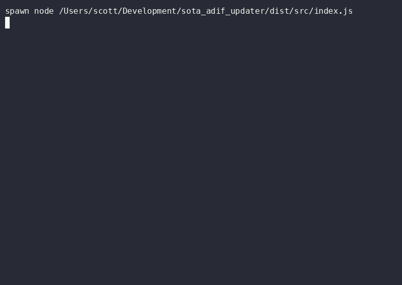

# SOTA (and POTA) ADIF Updater

A CLI utility to add SOTA and POTA references to an existing ADIF file.

## Installation

Requires Node.js 22 or later.

Install globally from npm:

```bash
npm install -g @spowers42/sota-adif-updater
```

Once installed, the `sota-adif-updater` command will be available in your terminal.

## Demo



## Usage

```bash
sota-adif-updater
```

The tool will interactively prompt you for the information needed to update your ADIF file.

## Releasing a new version

1. Ensure all changes are merged to `main` and CI is green.
2. On `main`, bump the version and create a git tag:
   ```bash
   npm version patch   # or minor / major
   ```
3. Push the commit and tag:
   ```bash
   git push origin main --tags
   ```
4. Go to **GitHub → Releases → New Release**, select the tag, add release notes, and click **Publish release**.

The release workflow will automatically build the project and publish the new version to npm.
